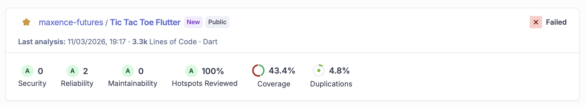

# Tic Tac Toe Flutter

A **Player vs CPU** Tic-Tac-Toe game built with Flutter, following strict **Clean Architecture** principles.  
The project serves as a reference implementation showcasing state management with Riverpod, declarative navigation with AutoRoute, local persistence with Drift, and continuous code quality with SonarCloud.

---

## Table of contents

- [Features](#features)
- [Architecture](#architecture)
- [Tech stack](#tech-stack)
- [Getting started](#getting-started)
- [Code generation](#code-generation)
- [Running tests & coverage](#running-tests--coverage)
- [Code quality — SonarCloud](#code-quality--sonarcloud)
- [CI/CD — GitHub Actions](#cicd--github-actions)
- [Project structure](#project-structure)

---

## Features

| Feature | Description |
| --- | --- |
| **Player profiles** | Create and switch between multiple player profiles, persisted via SharedPreferences |
| **Difficulty levels** | Easy / Medium / Hard CPU opponent powered by a Minimax algorithm |
| **Game board** | Animated 3×3 board with winning line highlight |
| **Game history** | Browse all past games, sorted by date — with a confirmation-gated "clear all" action |
| **Move replay** | Step-by-step replay of any recorded game |
| **Internationalization** | French 🇫🇷 and English 🇬🇧 supported via ARB files |

---

## Architecture

The project follows **Clean Architecture** with a strict feature-first folder structure.

```text
lib/
├── core/                    # Shared infrastructure
│   ├── database/            # Drift database + models
│   ├── domain/
│   │   └── game_rules/      # BoardRules — pure, shared game logic (win detection)
│   ├── extensions/          # BuildContext extensions (theme, l10n, etc.)
│   ├── l10n/                # ARB files (i18n source of truth)
│   ├── router/              # AutoRoute configuration
│   ├── services/            # SharedPreferences, ErrorTracking (interface + impl)
│   ├── utils/               # TttProviderObserver (Riverpod logger)
│   └── ui/
│       ├── theme/           # AppColors, AppSpacing, AppTypography, AppDurations
│       └── widgets/         # Shared widgets: TttBoardWidget, DifficultyBadge…
└── features/
    ├── game/
    │   ├── data/            # Drift repository impl
    │   ├── domain/          # Entities (Freezed), repository interfaces, use cases
    │   │                    # GameState carries canPlayerMove / withMove / evaluate
    │   └── presentation/    # GameNotifier, pages, widgets
    ├── history/
    │   ├── data/
    │   ├── domain/
    │   └── presentation/    # HistoryNotifier, GameReplayNotifier
    ├── home/
    └── player/
        ├── data/            # SharedPreferences repository impl
        ├── domain/
        └── presentation/    # PlayerNotifier
```

### Dependency rule

`presentation` → `domain` ← `data`

Repository interfaces live in `domain/`, concrete implementations in `data/`.  
Pure game rules that are shared across features (`BoardRules`) live in `core/domain/` to avoid cross-feature imports.

### Domain logic on entities

State transitions that depend only on `GameState` are extension methods on the entity itself, keeping the notifier as an orchestrator only:

| Method | Responsibility |
| --- | --- |
| `GameState.canPlayerMove(int)` | Guard: is the human allowed to play here? |
| `GameState.withMove(int, String)` | Pure state transition: apply a move |
| `GameState.evaluate()` | Determine won / draw / still playing |

---

## Tech stack

| Concern | Package |
| --- | --- |
| State management | `flutter_riverpod` + `riverpod_generator` |
| Navigation | `auto_route` + `auto_route_generator` |
| Local DB | `drift` + `drift_flutter` |
| Preferences | `shared_preferences` |
| Immutability / serialization | `freezed` + `json_serializable` |
| Functional error handling | `dartz` (`Either<Exception, T>`) |
| Animations | `flutter_animate` |
| i18n | `flutter_localizations` + `intl` + `gen-l10n` |
| Testing | `flutter_test` + `mockito` |

---

## Getting started

**Prerequisites**: Flutter ≥ 3.x, Dart SDK ≥ 3.11

```bash
# 1. Clone the repo
git clone https://github.com/<your-org>/tic_tac_toe_flutter.git
cd tic_tac_toe_flutter

# 2. Install dependencies
flutter pub get

# 3. Generate code (Riverpod, AutoRoute, Drift, Freezed, JSON, l10n)
dart run build_runner build --delete-conflicting-outputs
flutter gen-l10n

# 4. Run
flutter run
```

---

## Code generation

All generated files (`*.g.dart`, `*.freezed.dart`, `*.gr.dart`) are excluded from version control.  
Run the watcher during development:

```bash
dart run build_runner watch --delete-conflicting-outputs
```

Or use the one-shot build:

```bash
dart run build_runner build --delete-conflicting-outputs
```

---

## Running tests & coverage

```bash
# All tests
flutter test

# Tests + LCOV coverage report (strips generated files)
make coverage
```

The `make coverage` target runs `scripts/coverage.sh`, which:

1. Executes `flutter test --coverage`
2. Strips generated files from `coverage/lcov.info` with `lcov --remove`
3. Optionally opens an HTML report in your browser (requires `brew install lcov`)

### Test coverage

| Area | Test file |
| --- | --- |
| Database schema | `test/core/database/app_database_test.dart` |
| SharedPreferences service | `test/core/services/shared_preferences/shared_preferences_service_test.dart` |
| Error tracking service | `test/core/services/error_tracking/error_tracking_service_test.dart` |
| GetCpuMoveUsecase (Minimax) | `test/features/game/domain/usecases/get_cpu_move_usecase_test.dart` |
| SaveGameUsecase | `test/features/game/domain/usecases/save_game_usecase_test.dart` |
| GameNotifier | `test/features/game/presentation/providers/game_notifier_test.dart` |
| GetGameHistoryUsecase | `test/features/history/domain/usecases/get_game_history_usecase_test.dart` |
| GameReplayNotifier | `test/features/history/presentation/providers/game_replay_notifier_test.dart` |
| PlayerProfileRepositoryImpl | `test/features/player/data/repositories/player_profile_repository_impl_test.dart` |

The Minimax (`hard` difficulty) is tested with a **"never loses"** property test: 100 games are simulated against a random opponent and O must never lose.

---

## Code quality — SonarCloud

> **Prerequisites**: `brew install sonar-scanner lcov`

The project is analysed by [SonarCloud](https://sonarcloud.io). Generated files (`*.g.dart`, `*.freezed.dart`, `*.gr.dart`, `lib/l10n/`) are excluded from analysis.

### Run locally

```bash
# Export your token once (add to ~/.zshrc to persist)
export SONAR_TOKEN=<your_sonarcloud_token>

# Generate coverage then scan
make ci-quality
# or individually:
make coverage
make sonar
```

### SonarCloud dashboard

<!-- TODO: replace with your actual SonarCloud summary screenshot -->


---

## CI/CD — GitHub Actions

The workflow defined in [`.github/workflows/sonar.yml`](.github/workflows/sonar.yml) runs on every push and pull request targeting `main` or `develop`.

```text
push / PR
    │
    ▼
┌──────────────────────────────────────────────┐
│  1. Checkout (full history for Sonar blame)  │
│  2. Setup Flutter (stable)                   │
│  3. flutter pub get                          │
│  4. build_runner + gen-l10n                  │
│  5. flutter test --coverage                  │
│  6. lcov --remove  (clean generated files)   │
│  7. SonarCloud Scan                          │
└──────────────────────────────────────────────┘
```

**Required GitHub secret**: add `SONAR_TOKEN` in  
*Settings → Secrets and variables → Actions → New repository secret*.

---

## Project structure

```text
.
├── .github/
│   └── workflows/
│       └── sonar.yml                   # CI — test + SonarCloud scan
├── lib/
│   ├── app.dart
│   ├── main.dart
│   ├── core/
│   │   ├── domain/game_rules/ # BoardRules (shared win-detection logic)
│   │   ├── services/          # ErrorTracking + SharedPreferences (interface + impl)
│   │   └── ui/theme/          # AppColors, AppSpacing, AppTypography, AppDurations
│   └── features/
├── test/
│   ├── core/
│   └── features/
├── scripts/
│   └── coverage.sh                     # Local coverage helper
├── Makefile                            # coverage | sonar | ci-quality
├── sonar-project.properties            # SonarCloud configuration
├── l10n.yaml
└── pubspec.yaml
```
